# Digest Authentication with IIB/App Connect

In this Code Pattern, we will learn how to build a service in IBM integration bus which can be exposed as a proxy to achieve digest authentication. We will learn how the digest authentication mechanism works in background and what logic needs to be built for a platform which doesn’t support digest authentication of its own. We will also learn how to expose the IIB service on a IBM cloud Kubernetes cluster and consume it via a sample client. Entire façade application and client application is built on IBM integration bus and deployed on Kubernetes node using a Docker image. 

When the reader has completed this code pattern, they will understand how to:
* Create a message flow and build logic for digest Authentication.
* Deploy and test application locally.
* Deploy and test application expose the IIB service to Kubernetes.

## Flow Diagram
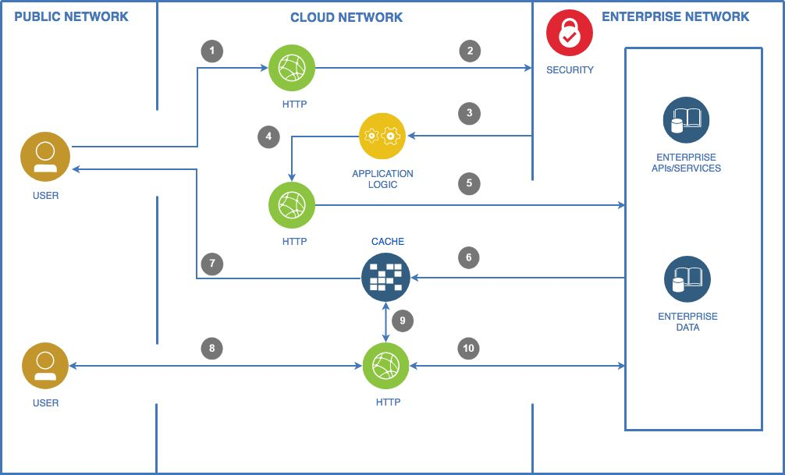

## Flow
1. User sends request to IIB application on cloud. 
2. Application sends request to server seeking authorisation.
3. Request is rejected by the server asking for an authorisation and server responds with the details to create authorisation.
4. Application builds authorisation logic.
5. Application sends another request to server seeking authorisation. 
6. Request is successfully authorised. 
7. Application saves authorisation header or cookies in cache for next http request and respond with success.
8. User sends next request to IIB application on cloud.
9. Application sends request with cached data to server seeking authorisation.
10. Server authorises user.    
11. Success response sent back to user.

## Included components
* [IBM Cloud](https://www.ibm.com/cloud/): IBM Cloud is a suite of cloud computing services from IBM that offers both platform as a service (PaaS) and infrastructure as a service (IaaS). With IBM Cloud IaaS, organizations can deploy and access virtualized IT resources.
* [Docker](https://www.docker.com/): Docker provides container software that is ideal for developers and teams looking to get started and experimenting with container-based applications. 
* [Kubernetes](https://kubernetes.io/): Kubernetes is an open-source container-orchestration system for automating deployment, scaling and management of containerized applications.
* [SoapUI](https://www.soapui.org/): SoapUI is an open-source web service testing application for service-oriented architectures and representational state transfers. 

## Featured technologies
* [IBM Integration bus](https://www.ibm.com/support/knowledgecenter/en/SSMKHH_10.0.0/com.ibm.etools.msgbroker.helphome.doc/help_home_msgbroker.htm): IIB allows business information to flow between disparate applications across multiple hardware and software platforms. Rules can be applied to the data flowing through the message broker to route and transform the information IIB provides access to various inbuilt nodes which provide ready to use capability.
* [Digest Authentication](https://en.wikipedia.org/wiki/Digest_access_authentication): Digest access authentication is one of the agreed-upon methods a web server can use to negotiate credentials, such as username or password, with a user's web browser. This can be used to confirm the identity of a user before sending sensitive information, such as online banking transaction history.

# Watch the Video

To-be-included

## Prerequisites:
* Access to IBM cloud tools: To interact with IBM cloud, IBM Cloud CLI will need to be installed beforehand. Please follow steps in below link to setup your IBM cloud tools.
https://console.bluemix.net/docs/containers/cs_cli_install.html#cs_cli_install

* IBM Integration Bus toolkit: In this code pattern we will use IIB toolkit version 10.0.0.9 to demo the logic and implementation. This logic can be implemented by any development tool available to you. 

# Steps
1.	[Create Service](#1-create-service)
2.	[Deploy service locally and test](#2-deploy-service-locally-and-test) 
3.	[Create cluster and deploy on IBM cloud](#3-create-cluster-and-deploy-on-ibm-cloud)
4.	[Test API on Cloud](#4-test-api-on-cloud)

### 1. Create Service
#### Main message flow

This is the main flow where request is received at Http Input node and once the transaction is complete it responds by the HTTP reply node.

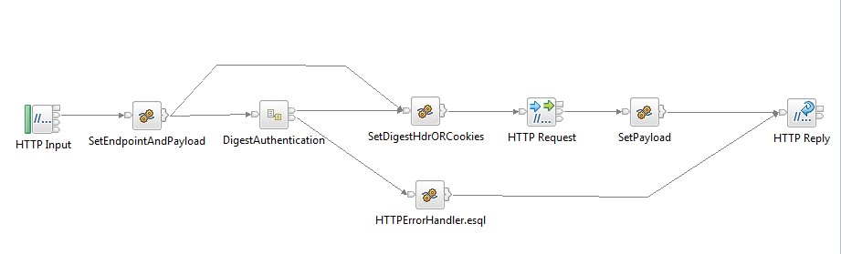

Below are the brief details on the functionality of each node. These nodes functionality can be replicated by similar tools/nodes available on other development platforms.

`HTTP Input`: This node is the start of a transaction and accepts the request to be processed. In HTTP node property we need to configure the URI which will be exposed as an API.

`SetEndpointAndPayload`: This is a node to store server URLs, user name and password to access digest authentication server. These configurations can be done in different ways on different development tools.

`DigestAuthentication subflow`: This is the component where the core logic is built.   In detail examination will be in the subflow section.

`SetdigestHdrORCookies`: This node is used to set the Authorization in HTTP RequestHeader. For a successful authentication the http request header must have either a valid authorisation header or cookies information.

`Set Payload`: This node simply outputs the response which server has sent after successful authentication.

#### Digest Authentication subflow(resuable)
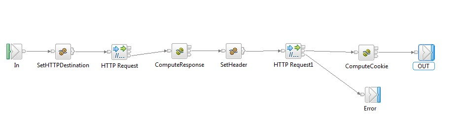

`SetHTTPDestination`: This node override and set the request URL and the request method to be set on HTTP Request node.

`ComputeResponse`: Whenever the first time a request is sent to the digest authentication enabled server, it will fail. The reason for failure is that the request sent to the server is plain http but for successful authentication, it needs to be with an authorisation header or cookies. There are few steps in this node to built core logic

1. Capturing response data: When server rejects access, it sends back the information to the client asking for authorisation header along with its server information in HTTP header . In WWW-Authenticate element of header response there will be information about nounce, relam, qop which will be used to create authorisation header.


2. Calculating hash: Once the values of required are captured. Following hash values needs to be created using the md5 algorithm.

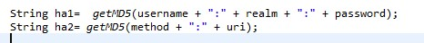

3. Creating a response seed: Response seed is the combination of generated md5 hash and nonce, ncvalue, cnonce, qop. This response seed is again encrypted with the md5 algorithm  to generate the final response seed which will be set in the authorisation header.

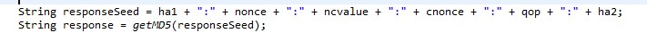

4. Creating authorization Header: In this step the all the parameters and their values are set and this header is sent to server for authorisation. 

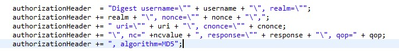

`Set Header`: This node is used to save the authorisation header in the http request header before sending request to the server for authentication.

`Set cookies`: After sending the request with authorisation header, the response from the server should be a success. With this success response the server sends the cookie information which can be used to authenticate without calculating the authorisation header every time. One can either store cookies or the authorisation header to successfully authenticate the request next time.

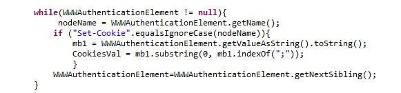


### 2. Deploy service locally and test 

For demo purpose we will create 2 services. One with authorisation logic and another as a sample client to access the first service. 

`DigestAuthentication`: This service contains the logic of implementing digest authorisation. This service will be exposed on uri /digesthttpapi for external clients to access.

`MyHttpApiClient`: This service is a simple client without any logic and it will be consuming the first service. This client service will be exposed on the uri /myhttpapiclient

For simplicity, we will package the service and the client service in a single bar named `DigestAuthenticationDemo.bar`.

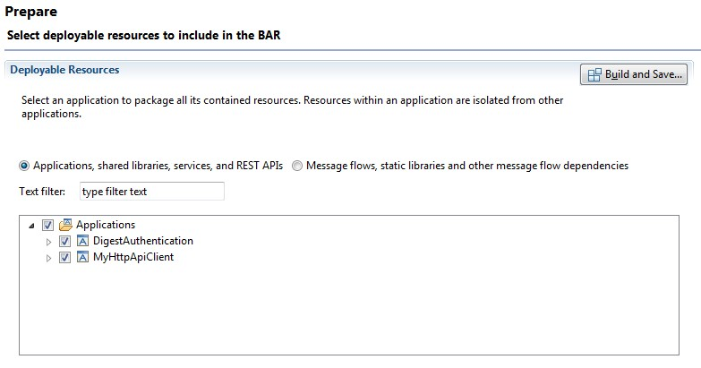

Test locally: In the test, we have used a sample api using digest authentication and is available on internet for testing. Below are the details which can also be found in code.

```
url: http://httpbin.org/digest-auth/auth/user/passwd

username: user

Password: passwd
```

Below is the result on testing on local environment.

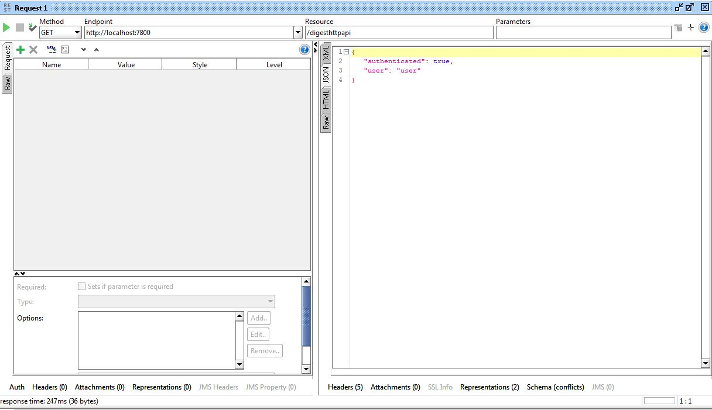

IBM integration bus provide a very useful functionality called flow exerciser which captures the path which the transaction as taken for each request. 

First request: On the first transaction, we can see that the transaction went through digest authentication subflow to do all the logic for authentication.

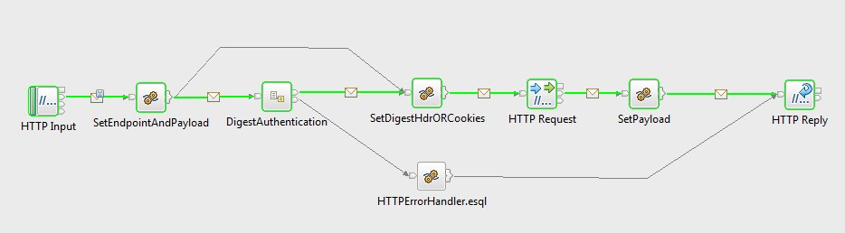

Next request: On the second or the next requests, Flow has skipped the digest authentication subflow an just reused the authorisation header from cache for better performance. Since the external api used is a simple one hence is not secured and authorisation headers or cookies can be reused. For a real environment one need to recall this digest authentication subflow to re-create headers/cookies on rejection.

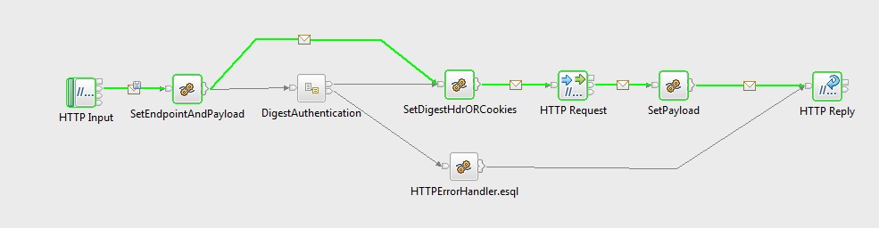


### 3. Create cluster and deploy on IBM cloud

Steps:

1. Login to your IBM cloud account: https://www.ibm.com/cloud/

2. Create cluster: Under containers section, go to clusters and click on create cluster.

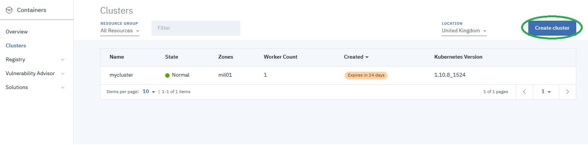

3. Create private repository: It takes some time for cluster to be created hence in the meantime please create your private repository. This private repository is a replica of the IBM public repository with docker image of IBM Integration Bus.

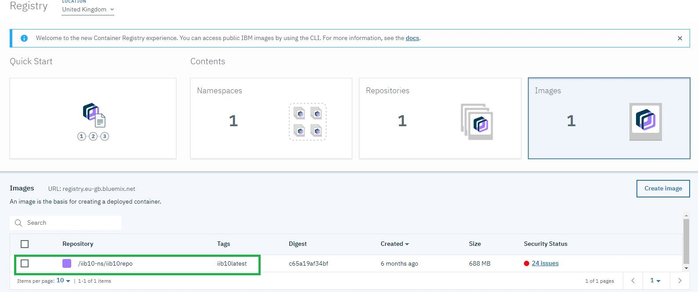

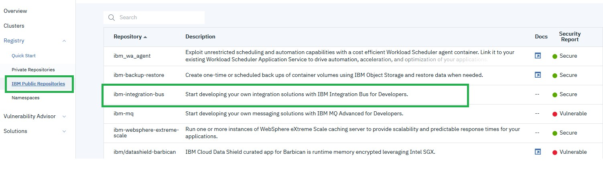

4. Once the cluster is in normal state then issue below commands to access your cluster

```
ibmcloud login --sso -a https://api.eu-gb.bluemix.net
ibmcloud cs region-set uk-south
ibmcloud cs cluster-config mycluster
export KUBECONFIG=%HOMEPATH%\.bluemix\plugins\container-service\clusters\mycluster\kube-config-mil01-mycluster.yml
kubectl get nodes
```

5. Once the above commands as executed successfully then we need to deploy our IIB image on the kubernetes cluster and expose the webadmin and http port. This can be done with below commands

```
kubectl run ku-iib --image=registry.eu-gb.bluemix.net/rriibns/rriibrepo --env="LICENSE=accept" --env="NODENAME=IB10NODE"
kubectl expose deployment/ku-iib --type=NodePort --port=4414 --target-port=4414 --name=ib10node-svc-4414
kubectl expose deployment/ku-iib --type=NodePort --port=7800 --target-port=7800 --name=ib10node-http-7800
```
Now one can see the information on kubernetes dashborad as below

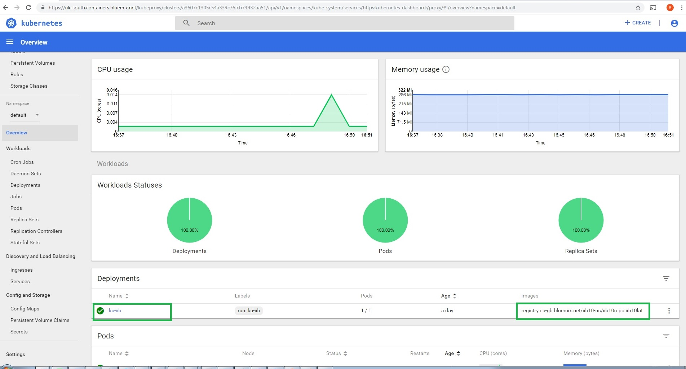

6. To access your IIB webadmin we will be public ip. Please run below command to get the info.

```
bx cs workers mycluster
```
7. Under services link you can check port on which the IIB webadmin and http port are mapped.

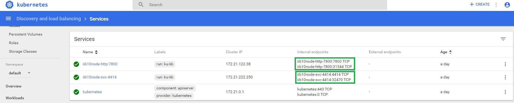

8. Deploy the bar on IBM cloud : Access the IIB web admin on from the IP and port from above steps and then deploy the DigestAuthenticationDemo.bar

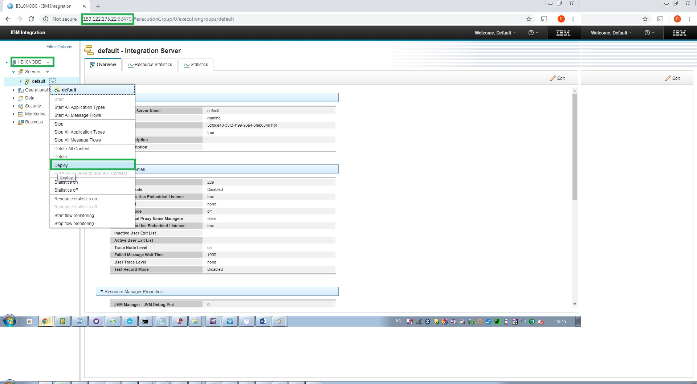

### 4. Test API on Cloud

Test the client application using IBM cloud public IP and port. It should produce same result as local tests.

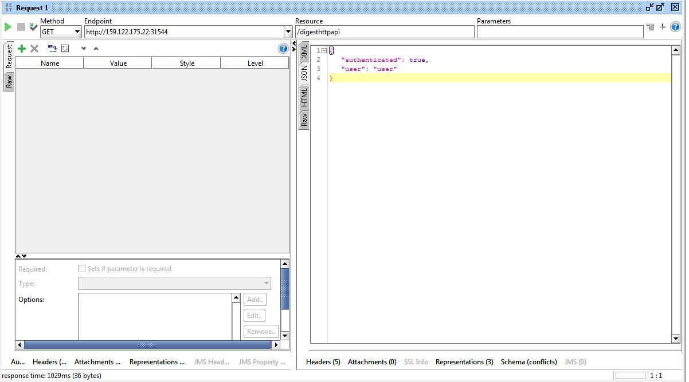


