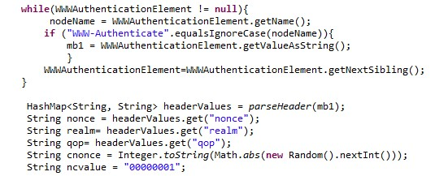

# Digest Authentication with IBM Integration Bus/App Connect

In this Code Pattern, we will learn how to build a service in IBM integration bus which can be exposed as a proxy to achieve digest authentication. We will learn how the digest authentication mechanism works in background and what logic needs to be built for a platform which doesn’t support digest authentication of its own. We will also learn how to expose the IIB service on a IBM cloud Kubernetes cluster and consume it via a sample client. Entire façade application and client application is built on IBM integration bus and deployed on Kubernetes node using a Docker image. 

When the reader has completed this code pattern, they will understand how to:
* Create a message flow and build logic for digest Authentication
* Deploy and test application locally 
* Deploy and test application expose the IIB service to Kubernetes

## Flow Diagram

## Flow
1. User sends request to application. 
2. Application sends request to server seeking authorisation.
3. Request is rejected by the server asking for an authorisation and server responds with the details to create authorisation.
4. Application builds authorisation logic.
5. Application sends another request to server seeking authorisation. 
6. Request is successfully authorised. 
7. Application saves authorisation header or cookies in cache for next http request and respond with success.
8. User sends request to application.
9. Application sends request with cached data to server seeking authorisation.
10. Server authorises users.    
11. Success response sent back to user

## Included components
* [IBM Cloud](https://www.ibm.com/cloud/): IBM Cloud is a suite of cloud computing services from IBM that offers both platform as a service (PaaS) and infrastructure as a service (IaaS). With IBM Cloud IaaS, organizations can deploy and access virtualized IT resources.
* [Docker](https://www.docker.com/): Docker provides container software that is ideal for developers and teams looking to get started and experimenting with container-based applications. 
* [Kubernetes](https://kubernetes.io/): Kubernetes is an open-source container-orchestration system for automating deployment, scaling and management of containerized applications.
* [SoapUI](https://www.soapui.org/): SoapUI is an open-source web service testing application for service-oriented architectures and representational state transfers. 

## Featured technologies
* [IBM Integration bus](https://www.ibm.com/support/knowledgecenter/en/SSMKHH_10.0.0/com.ibm.etools.msgbroker.helphome.doc/help_home_msgbroker.htm): IIB allows business information to flow between disparate applications across multiple hardware and software platforms. Rules can be applied to the data flowing through the message broker to route and transform the information IIB provides access to various inbuilt nodes which provide ready to use capability.
* [Digest Authentication](https://en.wikipedia.org/wiki/Digest_access_authentication): Digest access authentication is one of the agreed-upon methods a web server can use to negotiate credentials, such as username or password, with a user's web browser. This can be used to confirm the identity of a user before sending sensitive information, such as online banking transaction history.

# Watch the Video

To-be-included

## Prerequisites:
* Access to IBM cloud tools: To interact with IBM cloud, the IBM Cloud CLI will need to be installed beforehand. Please follow steps in below link to setup your IBM cloud tools.
https://console.bluemix.net/docs/containers/cs_cli_install.html#cs_cli_install

* IBM Integration Bus toolkit: In this code pattern we will use IIB toolkit version 10.0.0.9 to demo the logic and implementation. This logic can be implemented by any development tool available to you. 

# Steps
1.	[Create Service](#1-create-service)
2.	[Deploy service locally and test ] (#2 Deploy service locally and test) 
3.	Create Kubernetes cluster and deploy on IBM cloud
4.	Test API on Cloud

### 1. Create Service
Main message flow
This is the main flow where request is received at Http Input node and once the transaction is complete it responds by the HTTP reply node.

Below are the brief details on the functionality of each node. These nodes functionality can be replicated by similar tools/nodes available on other development platforms.

`HTTP Input`: This node is the start of a transaction and accepts the request to be processed. In HTTP node property we need to configure the URI which will be exposed as an API.

`SetEndpointAndPayload`: This is a node to store server URLs, user name and password to access digest authentication server. These configurations can be done in different ways on different development tools.

`DigestAuthentication subflow`: This is the component where the core logic is built.   In detail examination will be in the subflow section.

`SetdigestHdrORCookies`: This node is used to set the Authorization in HTTP RequestHeader. For a successful authentication the http request header must have either a valid authorisation header or cookies information.

`Set Payload`: This node simply outputs the response which server has sent after successful authentication.

#### Digest Authentication subflow(resuable)

`SetHTTPDestination`: This node override and set the request URL and the request method to be set on HTTP Request node.

`ComputeResponse`: Whenever the first time a request is sent to the digest authentication enabled server, it will fail. The reason for failure is that the request sent to the server is plain http but for successful authentication, it needs to be with an authorisation header or cookies. There are few steps in this node to built core logic

1. `Capturing response data`: When server rejects access, it sends back the information to the client asking for authorisation header along with its server information in HTTP header . In WWW-Authenticate element of header response there will be information about nounce, relam, qop which will be used to create authorisation header.

2. Calculating hash: Once the values of required are captured. Following hash values needs to be created using the md5 algorithm.

3. Creating a response seed: Response seed is the combination of generated md5 hash and nonce, ncvalue, cnonce, qop. This response seed is again encrypted with the md5 algorithm  to generate the final response seed which will be set in the authorisation header.

4. Creating authorization Header: In this step the all the parameters and their values are set and this header is sent to server for authorisation. 

Set Header: This node is used to save the authorisation header in the http request header before sending request to the server for authentication.

Set cookies: After sending the request with authorisation header, the response from the server should be a success. With this success response the server sends the cookie information which can be used to authenticate without calculating the authorisation header every time. One can either store cookies or the authorisation header to successfully authenticate the request next time.

### 2. Deploy service locally and test 

